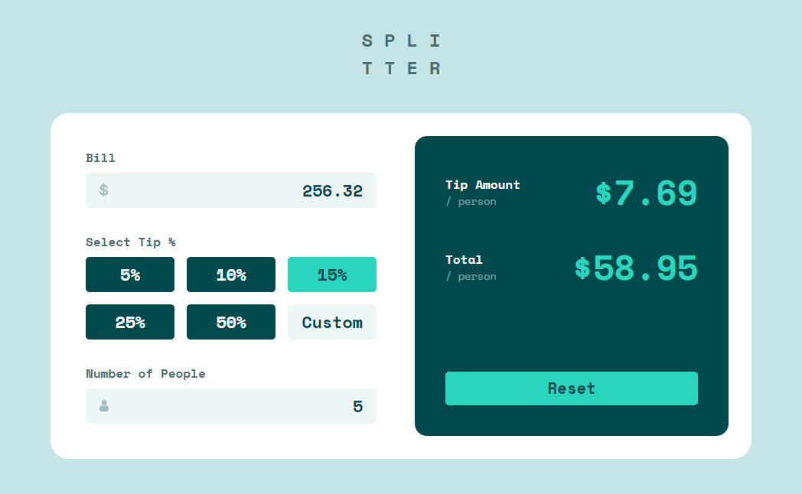
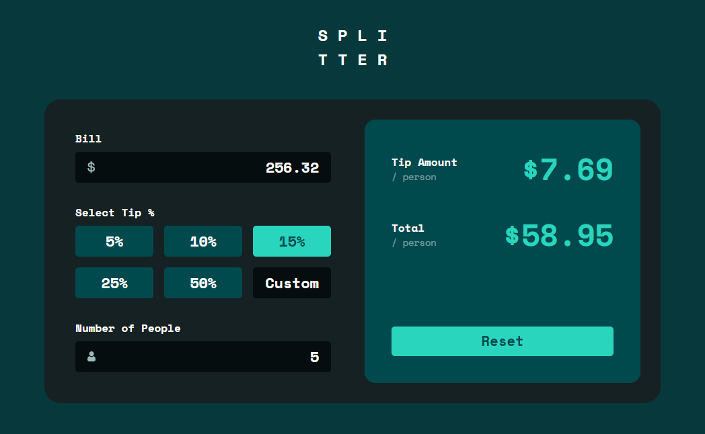

# Solution for Frontend Mentor: Tip Calculator App

Access here: https://diego-pvlk.github.io/splitter/

- Pure CSS and JS
- Dark mode compatible
- Fully functional app with responsive design for any screen size
- You can use as a Chrome WebApp:
    - Desktop: Menu > More tools > Create shorcut...
    - Mobile: Menu > Add to Home screen

